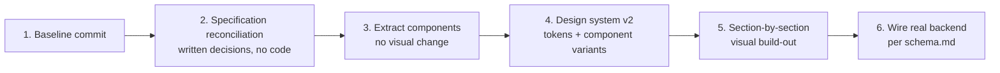

# SosrG — Design Document

**Audience:** designers, product, engineering, and non-technical stakeholders.
**Purpose:** document the current visual system as implemented today, evaluate it honestly, fold in design-relevant ideas from the platform's full product specification that aren't built yet, and lay out a concrete direction for the next design phase.

---

## Part A — The current design system, as built

### A1. Identity

"Cinematic" is the intended mood: deep navy-black background, gold accents, serif display type, glass/frosted panels — evoking a premium film-industry, red-carpet feel. It's applied consistently as a token system, which is the one genuinely solid piece of the current design.

### A2. Color tokens

| Token | Dark mode value | Light mode value | Used for |
|---|---|---|---|
| Cinematic Black | `#040b16` (near-black navy) | `#f8fafc` (near-white) | Page background |
| Cinematic Gray | `#0a1428` | `#ffffff` | Secondary surfaces |
| Gold | `#D4AF37` | `#b8860b` (darker, for contrast on light bg) | Primary accent, CTAs, active states |
| Crimson | `#8B0000` | (unchanged) | Danger/urgent/admin-only accents |
| Vibrant gradients (×4) | 4 distinct gradient pairs (pink→purple→indigo, cyan→blue→purple, amber→orange→rose, emerald→teal→cyan) | Adjusted per-mode gradients | Section-title accents, rotated per module |

**Observation:** four unrelated "vibrant" gradients plus gold plus crimson is six accent identities competing for attention with no documented rule for which module gets which. In practice they're assigned by feel, a convention that exists only in implementation, nowhere written down, easy to drift further as more screens are added.

### A3. Typography

- **Sans** (Outfit) — UI text, body copy, labels.
- **Serif** (Cormorant Garamond, italic-heavy) — every large display heading, used throughout for the cinematic feel.
- **Mono** (JetBrains Mono) — declared as a token but rarely used in practice.
- A consistent micro-typography pattern (small uppercase, wide letter-spacing, muted color) for eyebrow labels above headings repeats correctly across dozens of screens — a sign the visual language is coherent even where the underlying feature isn't fully built yet.

### A4. Core components (currently implemented as utility classes, not shared components)

- **Glass panel** — the dominant card container throughout: translucent overlay, blur, subtle border, soft shadow, with five tinted variants reusing the same recipe with a different hue.
- **Buttons** — no shared Button component exists yet; every button is a one-off styled element. A primary-CTA convention is followed by habit, not enforced by a shared component — meaning it can, and demonstrably already does, drift (see A7 below).
- **Modals** — a consistent enter/exit motion pattern, but each modal is bespoke rather than built from a shared Modal component.
- **Toasts** — a consistent bottom-corner confirmation-toast pattern is used for every mock action across the Marketplace module — a genuinely reusable interaction pattern currently duplicated per-screen rather than extracted into one.

### A5. Motion

A consistent motion layer is used for whole-section page transitions, tab-content swaps, modal enter/exit, mobile navigation, animated background elements, and progress-bar fills. This is the single most consistently well-executed layer of the current build — timing and easing feel deliberate and are applied uniformly across the product.

### A6. Light/dark mode — a structural weak point

Dark/light switching is currently implemented as one global style override rather than each component branching on the active theme. This works today because every component happens to use the small set of styles the override targets, but it's brittle: any new component using a style outside that targeted set will silently render incorrectly in light mode — and at least one such case already exists in the current build. This should move to a proper theme-aware component system rather than a global CSS override as part of the next design phase.

### A7. Responsive design

Standard breakpoint conventions are used throughout — a single-column mobile layout stepping up to a 3–4 column desktop grid, with a soft middle step for tablet. No dedicated tablet-specific design pass is evident; the jump from mobile to desktop is the primary consideration today.

### A8. Internationalization as a design concern

Six-language support exists in the token/content structure but is only wired into two of the product's 28 screens today — the navigation bar and the homepage hero. This means the language switcher currently promises more than it delivers: it's presented as a global control but only affects a small fraction of visible content. The next design phase needs to either finish translation coverage or visibly scope the switcher down to what it actually affects until that coverage is complete.

### A9. Content quality as a design concern

Two content issues sit at the design/content boundary:
- **Real, named public figures used as placeholder data** across several network, mentorship, and news screens, shown with fabricated quotes, rates, and relationships. This reads as authentic content at a glance, which is exactly the problem, and should be replaced with clearly fictional personas before any further design work builds on top of these screens.
- **Inconsistent product taxonomy** in the Art Mart catalog, where generic consumer goods sit alongside genuinely art/performance-specific items, undermining the "Art Mart" framing. Worth a deliberate content and category pass alongside any visual refresh of that screen.

---

## Part B — Design systems specified but not yet built

The platform's full product specification describes several concrete visual/UX systems that are genuine product differentiators and are not implemented today beyond a single verified/unverified badge. These are strong candidates for the next design phase, not new concepts to invent from scratch — they're already scoped in `schema.md`.

### B1. The account-tier trust system (Yellow / Green / Blue / Red + star rating)

A four-color account-status system, layered with a 1–5 star performance rating:
- **Yellow** — new/unverified account
- **Green** — ID-verified with a minimum connection count; gates commenting, posting, Art Mart selling, paid chat, and advertising
- **Blue** — high-performance or very high connection count
- **Red** — dead or policy-defaulted account

**Design opportunity:** this is a considerably richer trust signal than today's single binary badge, and it's a fully specified system already, not a blank slate. Since the current build already leans heavily on a verified-badge pattern across many screens, this is a matter of finishing an existing idea rather than inventing a new one. It needs: a badge/chip component with four color states, a way to layer the star rating without visually competing with the tier color, and placement rules across profile headers, applicant cards, network cards, and admin tables.

### B2. Digital resume generation

A printable, shareable digital resume generated from each profile's collected data. The current build has the button for this in two places with no template or generation logic behind either — a well-scoped, self-contained design deliverable (a print-optimized resume layout using data already defined in the profile schema) that could ship independently of the rest of the redesign as an early proof point.

### B3. Watermarking as a visible trust signal

SosrG-branded watermarking on shared or downloaded creative content, framed as copyright protection. This is a design decision (placement, opacity, variation by content type) as much as an engineering one, and pairs naturally with the legal/IP-timestamp features already represented in the interface.

### B4. Structured organization directory

A fuller organization-directory card design — accommodating office phone, fax, and department-head contact fields — is needed if the directory is meant to be a serious utility rather than a decorative grid, which is what it is today.

---

## Part C — Honest assessment

**What's working:**
- The token system (color, type, glass-panel family) is coherent and premium-feeling. The next phase should evolve this identity, not replace it.
- Motion and transition quality is genuinely good and consistent.
- The information architecture — seven creative sectors, with casting, auction, marketplace, ecosystem, academy, and community as top-level pillars — is ambitious but legible once you're in it.
- The verified-badge pattern, while incomplete relative to the full four-tier specification (B1), is a real and reasonably well-placed trust signal already threaded through multiple screens.

**What's not working, in design terms:**
1. **No component library.** Every button, card, badge, and modal is styled individually. This is why the light-mode issue in A6 exists, and it will only compound as more screens are built — there's no single place to fix "all primary buttons" or "all glass panels" at once.
2. **Six competing accent colors with no documented assignment rule.**
3. **The admin panel's visual language is indistinguishable from the consumer-facing product.** An internal moderation/ops tool wearing the same ornamental gold-and-glass skin as a talent marketplace sends the wrong signal to whoever operates it — internal tools typically want higher information density and less ornamentation.
4. **The language switcher currently promises more than it delivers** (A8).
5. **The onboarding wizard's "AI Verification" step manufactures false confidence** — a scripted verification-progress sequence when nothing is actually being verified yet. Worth revisiting regardless of backend timing, since it currently misleads the person going through it.
6. **Real public figures as placeholder content, and inconsistent product taxonomy** (A9) — content issues, not visual-design issues, but both need resolving alongside a visual pass on the screens where they appear.
7. **The account-tier trust system is already fully specified** (B1) — the next design phase has the opportunity to finish an existing, well-thought-out system rather than invent a new trust signal from nothing.

---

## Part D — Direction for the next design phase

### D1. Recommended scope split

Four tracks, sequenced or parallelized as capacity allows:

1. **Design system extraction** (do this first, regardless of everything else): turn the current ad-hoc styling into a real, documented component library — Button, Card/GlassPanel, Modal, Toast, Badge (including a proper four-state account-tier badge per B1, designed now even before it's wired to live data), and Tabs — each with defined variants, not one-off styling per instance. This alone resolves the light-mode drift risk (A6) and gives every future visual change one place to land.
2. **Visual/brand refinement**: bring the six-accent-color sprawl (Part C) down to a smaller, ruled palette — for example, gold as the single primary accent everywhere, with the vibrant gradients retired or reduced to one or two, reserved for marketing moments rather than used as a per-section identity system. A distinct, quieter visual language for the Admin panel so it reads as an internal tool rather than a consumer surface.
3. **Content & information-architecture build-out**: decide, screen by screen, which of the currently-decorative modules become real, backed by the production data model, and which parts of the full product specification (priority-artist categories, Foundation fundraising, Travels, watermarking, paid chat, tiered advertising) are in scope for the next phase versus deliberately deferred. Redesigning the visuals of a screen that's about to be cut, or building a visual for a franchise-fee structure that hasn't been finalized, is wasted effort — this decision needs to land before extensive visual work proceeds on those specific screens.
4. **Specification reconciliation** (do this early, in parallel with track 1): get an explicit, written decision from whoever owns the business model on the open items flagged in the architecture document — particularly the CP franchise fee/revenue-share figures and whether the full account-tier system is being built now or deferred. These are business decisions, not design decisions, but design work on the CP hierarchy, account badges, and onboarding is blocked on them.

### D2. Suggested working order

Step 2 costs nothing in engineering time and de-risks everything after it — the CP fee/revenue-share question and the account-tier decision in particular are cheap to resolve on paper now and expensive to unwind after a visual system has already shipped a specific version. Step 3 (pure extraction, no visual change) is the safest first structural step because it's independently verifiable — the product should look identical before and after — before real visual risk is introduced in step 4 onward.

### D3. Rollback mechanics for design work

- Keep old and new component implementations available behind a flag per section during step 5, so any one section can be reverted to its prior visual state without affecting unrelated sections.
- Tag the commit immediately before any palette or token change lands, so a "go back to the previous look" request is a single command, not a manual re-edit.
- Treat the extracted component library (step 3) as the actual rollback unit going forward — reverting a bad Button variant change in one place is safe in a way that reverting scattered individual styling across dozens of screens never is. This is the main long-term payoff of doing extraction before visual iteration.

### D4. Open decisions before steps 4–5 begin

- **Accent palette** — collapse to a single primary accent, or keep a reduced two-color system?
- **Admin visual identity** — a fully separate design system from the consumer product, or the same system with a denser variant?
- **Internationalization** — finish translation coverage across all screens, or scope the language switcher down to what's actually translated until coverage is complete?
- **Onboarding honesty** — keep the current theatrical "AI Verification" step, or replace its copy so it doesn't imply verification is happening before it actually is?
- **Account-tier system (B1)** — build the full four-tier-plus-stars system now, or ship the current single badge a while longer? This has the widest blast radius of any open decision — profile headers, applicant cards, network cards, and admin tables all reference account status — so it's worth deciding earliest.
- **CP franchise fee/revenue-share figures** — which set of numbers is the actual product direction? The Ecosystem Hub screens can't be meaningfully finished until this is resolved, since eligibility copy and revenue-split figures depend on it directly.

None of these block starting track 1 (component extraction) — they only need answers before the visual build-out in track 2 begins in earnest.
