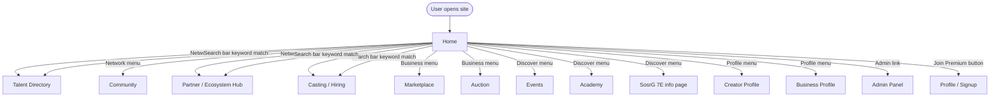
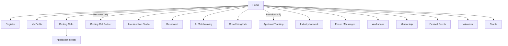

# SosrG — Flow Document

**Audience:** product managers, designers, QA, and non-technical stakeholders.
**Purpose:** describe what a person actually experiences moving through the product today — every screen, every tab, every button — and which controls look functional but currently do nothing.

---

## 1. How navigation currently works

There are no URLs for individual screens today. The application swaps its visible content based on which navigation item was last clicked, and refreshing the browser always returns to the homepage, in English, dark theme, logged out — nothing done in a session survives a reload.

The homepage search bar is the one clever bit of routing today: typing a keyword like "actor" or "casting" jumps to a relevant section rather than showing search results — it's a keyword-to-section shortcut, not a real search engine; nothing is actually queried against a database yet.

The floating "Smart Assistant" button (visible everywhere) opens a small popover with quick actions, one of which routes into the AI Tools section — a screen with no dedicated navigation entry of its own.

---

## 2. Onboarding & profile creation

Reached via **Join Premium**, **Profile**, **Creator Profile**, or **Business Profile** in the navigation — an 8-step wizard.

```mermaid
flowchart LR
    A[1. OTP Login] -->|any 6+ digit code passes, no SMS is sent| B[2. Mandatory KYC]
    B -->|Aadhar/PAN/Passport upload, not validated| C[3. Choose profile type]
    C -->|Artist / Buyer / Business / Casting Director| D[4. Choose industry + optional secondary]
    D -->|Theatre / Cinema / Literature / Music / Dance / Art / Crafts| E[5. Choose profession]
    E --> F[6. Select services offered]
    F --> G[7. Upload one work sample]
    G --> H[8. AI Verification]
    H -->|5-step animated pipeline| I[Experience level assigned<br/>fresher / intermediate / expert<br/>+ platform ID issued]
    I --> J[Dashboard: Profile System]
```

**What the wizard currently collects, exactly:** phone number and OTP; a KYC document; profile type; primary and optional secondary industry; profession; a set of selected services; one portfolio work sample; and an auto-generated platform ID at the end.

**What's real vs. simulated today, told plainly:**
- Step 1, "OTP Login" — no SMS is actually sent; any 6+ character code is accepted.
- Step 2, "Mandatory KYC" — the form specifically requests an Aadhar, PAN, or Passport upload. Any file is accepted; nothing is validated or transmitted anywhere yet.
- Step 8, "AI Verification" — a scripted five-step loading animation (portfolio scanning, voice & face matching, experience tagging, benchmarking, ID activation) runs, then an experience level is assigned essentially at random rather than from anything genuinely evaluated.
- **What this wizard does not yet collect**, despite the full profile specification calling for it in detail: body measurements, physical attributes (height, weight, eye and hair color), a comfort-with-content-type declaration, languages known, and shoot-availability preferences. That level of detail is defined in the production schema (`artist_profiles`) but only exists today as read-only display data elsewhere in the interface — a person going through onboarding is never actually asked for any of it.
- On completion, the person lands in the Profile System dashboard (§7), with up to 23 tabs depending on account type. Closing the tab or refreshing logs them out again — nothing persists yet.

A second, disconnected signup form exists inside the Casting section (§4, "Register" view) with OAuth-styled buttons that currently do nothing when clicked, unvalidated text fields, and a "Create Account" button that jumps straight to a dashboard view.

---

## 3. Home page — the pitch, section by section

Scrolling top to bottom: an animated hero with a search bar and stat counters; a "Discover / Build / Collaborate / Grow" four-card pitch; the seven creative sectors (Theatre, Cinema, Literature, Music, Dance, Art, Crafts) with featured talent cards; an embedded live demo of the AI Suite (§8 — where the one working AI feature lives); cross-sector collaboration tabs; a premium-features grid; a trust & legal pitch (AI rating and watermarking/blockchain badges — currently decorative, with no watermarking or blockchain integration behind them yet); a phone-mockup app preview (a marketing image — there is no separate native mobile app yet); a six-card monetization/revenue-model grid; and a footer.

Every "Hire Now" / "View Profile" card button on this page and on the Talent Directory is currently decorative.

---

## 4. Casting & Hiring — the largest module (17 views)

An Artist/Recruiter toggle changes tab labels and reveals two recruiter-only views (Casting Call Builder, Applicant Tracking).

| View | What's on screen | Real vs. currently decorative |
|---|---|---|
| **Home** | Trending casting calls, a featured-talent grid, a three-card industry news row | "View All" switches tabs (works); everything else is decorative |
| **Register** | OAuth-styled buttons, email/phone/location fields, a profession dropdown | All decorative; "Create Account" jumps to the dashboard with no validation |
| **My Profile** | Bio, language chips, special-skills chips, physical attributes (height, weight, eye and hair color), audition-video reels, a portfolio gallery, an experience timeline | Entirely display-only; edit/share actions are decorative |
| **Casting Calls** | A full casting-call list (title, production house, type, status, AI fit-score, budget match, requirements, location, payment); a sidebar match panel | "Apply Now" opens a working application modal (portfolio selection, video upload, cover letter, submission confirmation); a recruiter's "Advanced Talent Filter" opens a working modal, though its own Apply/Reset controls are decorative |
| **Casting Call Builder** (recruiter only) | AI-assisted mode (screenplay upload, "Generate Roles with AI") vs. detailed-form mode (title, house, type, location, description, budget, timeline, deadline, NDA flag, a dynamic role list) | "AI Auto-Detect Roles" has a real handler, but currently inserts two hardcoded canned roles rather than calling an AI service; Save/Publish are decorative |
| **Live Audition Studio** | A mock video-call interface, mic/video controls, an AI teleprompter overlay, "real-time" analysis bars, a panel-chat sidebar | Entirely decorative — no camera or microphone actually connects yet, and the chat's send control has no handler |
| **Dashboard** | A profile summary card, application stats, performance analytics, a recent-applications list | Static |
| **AI Matchmaking** | Capability cards, a top-matches list, an insights card | The recruiter's match percentage is randomized on every render rather than computed; the artist's "Apply Now" reuses the working application modal |
| **Crew Hiring Hub** | A Hire-Professionals / Find-Jobs toggle, sector filter pills, a jobs list, a professionals list | The toggle and sector filter genuinely filter the visible list; "Apply Now" opens the working application modal; "Hire Now" is decorative |
| **Applicant Tracking** (recruiter only) | Applicant cards with AI match percentage and status, two filter dropdowns | Filters are decorative; profile/message/shortlist actions are decorative |
| **Industry Network** | A search box, a suggested-connections grid, an industry-updates feed, network stats, a groups list | Entirely decorative |
| **Forum** | A Community/Messages toggle; Messages shows conversation threads and a chat UI; Community shows sector sub-forums and topic lists | Toggle works; the message send control has no handler; sub-forum selection and "New Topic" are decorative |
| **Workshops** | A search box and six workshop cards (title, instructor, date, sector, price) | "Register Now" is decorative |
| **Mentorship** | Three mentor cards with expertise tags, rating, and hourly rate; a "how it works" panel | "Book Session" and mentor matching are decorative |
| **Festival Events** | A search box and six event cards | "View Details & Register" is decorative |
| **Volunteer** | Four volunteer-opportunity cards | "Apply to Volunteer" is decorative |
| **Grants** | Filter pills and four grant/scholarship cards | Filters and "View Application" are decorative |

This module extends well beyond core casting functionality — it also absorbs professional networking, a workshop catalog, a mentorship marketplace, volunteering listings, and a grants board. All content is India-market specific (currency, city names, film-school credentials, and multi-language accent/dialect filtering).

---

## 5. Talent Auction — six modes

| Mode | What's on screen | Real vs. currently decorative |
|---|---|---|
| **Browse & Bid** (default) | Sector filter pills; auction cards with a live badge, current bid, countdown, manual-bid input, auto-bid, and buy-now price | Sector filter genuinely filters the list; bidding controls are decorative |
| **Create Auction** | A listing form: sector, title, minimum bid, buy-now price, duration | "Launch Auction" is decorative |
| **Analytics** | Revenue stat tiles and a weekly leaderboard | Static |
| **Contracts & Calendar** | Digital contract cards, a calendar-integration card, a ratings & reviews card | Static |
| **Upcoming** | An empty-state placeholder | Intentionally no content |
| **Wallet** | A cash-balance card, a coin balance, and a token balance used specifically for bidding | Add Funds/Withdraw/Buy Tokens are decorative |

A global "AI Value Predictor" modal is reachable from this module — it currently returns the same static price range regardless of input, rather than calling the valuation service it's designed to use.

This module applies a standard bid/buy-now/countdown pattern to talent, roles, and screenplay/IP rights — an unusual concept for a casting-adjacent platform, applied consistently throughout.

---

## 6. Marketplace — five modes, one of which is a four-tab sub-app

| Marketplace mode | What's on screen | Real vs. currently decorative |
|---|---|---|
| **Art Mart** | The dedicated Art Mart sub-app (below) | — |
| **Assets & IPs** | Sector-filtered listing cards for scripts, scores, production rights, and costume design | Opens a details modal; "Buy Now" triggers a confirmation toast with no real transaction yet |
| **Gigs & Freelance** | Sector-filtered gig cards | "Apply Now" triggers a toast; no application is recorded yet |
| **Collaborations** | Project cards with "looking for" role tags | "Connect" triggers a toast; no connection is made yet |
| **Licensing** | IP license cards (remake rights, sync license, royalty terms) | "Acquire License" triggers a toast referencing a smart-contract flow that isn't wired up yet |

Two shared modals: a Post Project/Listing form (submits to a confirmation toast, not yet persisted) and an Advanced Filters modal (Apply triggers a toast; Clear is decorative).

### Art Mart — the e-commerce sub-app

| Tab | What's on screen | Real vs. currently decorative |
|---|---|---|
| **Browse** | A category sidebar, one AI-recommendation card, and a product grid | Category filter works; wishlist/share/cart icons trigger confirmation toasts without persisting anything yet |
| **Sell** | An "AI Pricing Suggestion" panel and a listing form | "List Product" triggers a toast; no listing is created yet |
| **Custom Orders & Commissions** | Order cards with milestone-progress bars and a stated 30%-advance, milestone-release payment structure | "View Milestones"/"Message Client" trigger toasts |
| **Wishlist & Referrals** | Saved products and a refer-and-earn panel with referral stats | "Buy"/"Remove" trigger toasts |

The current product catalog mixes generic consumer goods with genuinely art/performance-specific items — worth a deliberate content and taxonomy pass as this module is built out for real.

---

## 7. Profile System — up to 23 tabs

Also reached as "Creator Profile" and "Business Profile," each forcing the artist or business type respectively. This is the largest single dashboard in the product: 14 tabs common to every account type, four artist-only, four business-only, and one shared legal tab.

**Common to every account type:**

| Tab | What's on screen | Real vs. currently decorative |
|---|---|---|
| Dashboard | Recent activity, a growth chart, an AI tip card, achievement progress | Static |
| Smart Discovery | Search and filter controls, trending and suggested panels | All decorative |
| Profile Details | Basic info, the type-specific advanced module (below), media gallery, social links | Edit/upload actions are decorative; social links themselves are real |
| Wallet | Cash balance, pending clearance, coin balance, token balance, transaction history, a stated withdrawal policy (minimum amount, fixed weekly cycle) | Withdraw/Add Funds are decorative; a payment-gateway integration is named in the copy but not yet wired up |
| Finances | Earnings/pending/active-contracts stat tiles, transaction list | Static |
| Bookings | Filter pills, booking cards | Filters and detail views are decorative |
| Network | Search box, connection grid | Decorative |
| Counselling | A templated career-guidance paragraph, three metric tiles | "Generate Full Report" is decorative |
| Management | Task tracker, payment-milestone lock list, deadline alerts, a productivity score | Static |
| Notifications | Five sample notifications with read/unread state | "Mark all as read" is decorative |
| Membership | Three-tier pricing cards | "Upgrade" is decorative |
| Reviews | Aggregate rating header, individual review cards | Static |
| Services | Gig-style service listings | "Add Service" is decorative |
| Privacy & Security | Visibility toggles, 2FA control, data-export/delete-account controls | Every control on this tab is currently decorative |

**Artist-only:** Portfolio (showreel cards) · Auditions Applied (status list) · Availability Calendar (a calendar-sync button with no calendar behind it yet) · AI Match Suggestions (a recommended-roles list and skill-gap analysis).

**Business-only:** Projects (progress-bar cards) · Casting Panel (empty state) · Budget Manager (three stat tiles) · Workflow Tracker (a four-stage production pipeline).

**Shared:** Legal — AI legal-tool cards (NDA generator, contract drafting, copyright timestamping), an IP-timestamp list, and an active-contracts list.

The **Actor/Model Advanced Module**, shown within Profile Details for artist accounts, is where the fuller actor-profile data appears today: physical attributes, experience categories, and a comfort declaration (content types the artist has consented to) — currently read-only display data rather than something collected or editable through the interface, and not yet asked for during onboarding (§2).

---

## 8. AI Suite — where the one working AI feature lives

Reachable from the homepage embed or the Smart Assistant's script-analysis quick action. Three tools in one panel:

| Tool | What happens |
|---|---|
| AI Casting Engine | A fake delay, then a hardcoded match-score result. Not yet real. |
| **AI Script Analyser** | Paste a script, run the analysis, and **a real request goes to the Gemini API** — the response genuinely extracts characters, locations, props, and a budget category from the submitted text. **This is the one genuinely working AI feature in the product today.** A failed request currently fails silently — the button just re-enables with no visible error, a real gap worth fixing independent of any larger build-out. |
| AI Legal Layer | Same fake-delay pattern as the Casting Engine. Not yet real. |

---

## 9. Ecosystem Hub — the Connecting Partner franchise layer (8 views)

An eight-view hub covering the CP hierarchy, a franchise scorecard view, a revenue-engine explainer, the Academy franchise program, an AI monitoring dashboard (with a Super Admin toggle exposing additional controls including a "Global System Reset" button), AI counselling, AI grading, and an AI event builder. All of this — scores, revenue numbers, the reset control — is currently decorative; nothing computes or resets anything real yet.

### 9.1 The CP tiers, as currently displayed

| Tier | Eligibility | Duration | Duties | Revenue |
|---|---|---|---|---|
| **PCP** — Pin-Code Connecting Partner | Active membership, verified account, 10 Actor/Model + 10 Business + 20 Creator profile referrals | Min. 1 year | Connect artists & vendors, manage pin-code data, run the local Art Mart storefront, local event creation | Referral coins & currency, event revenue share, recognition |
| **DCP** — District Connecting Partner | 1,000 users via own + subordinate PCP network | Min. 3 years | Career counseling, district events, monitor subordinate PCPs, implement the grading system | Referral income, district event revenue share, performance bonus |
| **SCP** — State Connecting Partner | 10,000 users via subordinate DCP network + credit for 100 guided events | Min. 5 years | Guide subordinate DCPs, monitor the state-level system, strategic programs | State-level revenue share, event commission, platform share |
| **ZCP** — Zonal Connecting Partner | Equivalent to SCP | Min. 5 years | Coordinate multiple states, regional program implementation | Zonal incentives, cross-state event share, elevated referral share |
| **SP** — SosrG Partner (Expert Personality) | Sustained CP tenure, clean standing record | 6 years | Live mentorship, public content on art and culture, guidance for the CP network | Premium visibility, honorary recognition, event invitations |

Also on screen: a "Franchise Structure" view showing tier cards with a fabricated AI performance score; a Gender Representation panel claiming an automated balance tracker is "perfectly balanced" (currently decorative — nothing is actually tracked or enforced yet); and an AI Grading view assigning artists letter grades, a separate concept from account status entirely.

### 9.2 What's specified but not yet built

- **The account-tier system and its promotion pathway.** The full four-tier account-status ladder (see the franchise specification) is what's meant to feed new PCP promotions once referral thresholds are met — currently only a single binary verified/unverified signal exists, so the CP ladder has no functioning entry point yet.
- **The one-seat-per-gender enforcement rule.** What's shown today is aggregate demographic statistics, not an enforced one-seat-per-gender constraint at each regional level.
- **Anything computing or persisting.** As with the rest of the product, referral counts, coin and currency balances, event credit totals, and CP-level promotions are not tracked anywhere yet.

---

## 10. Academy, Events, Community — supporting modules

### SosrG Academy (3 tabs)
- **AI Learning Paths** — recommended courses and a seven-sector explore grid. "Enroll Now" is decorative.
- **SosrG Scholarships** — an AI-eligibility status card and scholarship listings. "View Details" is decorative.
- **Progress Tracking** — a milestone list, an overall-progress ring, and earned certificates. Static.

### Event Management (single view)
A calendar grid, an upcoming-events list, one featured event, and a set of event-insight stat numbers. "Host an Event," "Book Now," and "Get Tickets" are currently decorative.

### Community Hub (3 tabs)
- **Arts Directory** — a search box, filter pills, and a grid of named institutions shown with just name, type, and location — considerably less structured than the full organization-directory specification, which calls for office phone, fax, and department-head contact fields per organization.
- **Content Sharing** — a post composer and a social feed (likes, comments, shares) — currently decorative; nothing is posted or persisted yet.
- **Industry News** — a featured story, a news grid, trending topics, and a newsletter signup whose subscribe action is currently decorative. The featured story currently uses a fabricated quote attributed to a real public figure — see the content-quality note in the architecture document.

---

## 11. Admin Panel — a specification, not yet a working tool

Nine tabs (Analytics, User Management, Casting Moderation, User Verification, Fraud Monitoring, Revenue & Commission, Content Moderation, Legal Escalation, Platform Settings). It's currently reachable by anyone — there is no access gate on it yet. Every approve/reject/save/toggle control across all nine tabs has no behavior wired up yet, including a "Review Chat Logs" control on a sample user report. Treat the current build as a specification for what the real admin tool should do, not as something to demonstrate as working.

---

## 12. "What's real today" cheat sheet

| Works for real | Looks real, doesn't yet |
|---|---|
| Navigating between sections and tabs | Any form submission anywhere |
| The homepage search-bar keyword router | Login/OTP/KYC (currently client-side only) |
| Theme toggle (dark/light) | Any bid, purchase, listing, or application persisting |
| Language toggle — on the navigation bar and homepage only | Most of the "AI" features across the app |
| The AI Script Analyser (a real model call) | The Admin panel (any tab, any control) |
| Sector and crew-mode filter pills in Casting and Auction | Payments (a named gateway is referenced, not integrated) |
| Modals opening and closing, confirmation toasts | The CP franchise ladder (no promotion pathway exists yet) |
| Tab switching within any section | Anything surviving a page refresh |
| | Watermarking, blockchain, and legal-timestamp claims |
| | The camera/mic-based Audition Studio |
| | Chat (all chat surfaces are currently free and decorative) |

---

## 13. Data inventory

The full production data model backing every screen described above — every entity, field, relationship, and constraint — is specified in `schema.md`. That specification is the authoritative reference for what each module needs to store; this document describes the experience each module should deliver once it's built against that model.
