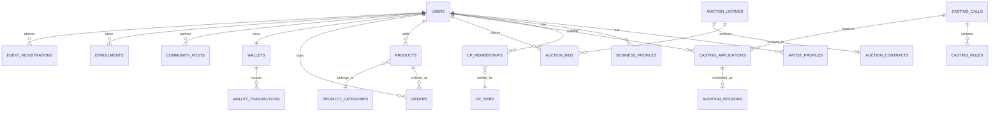

# SosrG Platform — Backend Data Schema

**Version:** 1.0 (production baseline)
**Scope:** relational data model for the SosrG creative-industries platform — identity & accounts, artist/business profiles, the Connecting Partner franchise network, casting & auditions, talent auctions, marketplace, academy, events, community & social, messaging, wallet & payments, notifications, AI services, legal/IP, and platform administration.
**Target engine:** PostgreSQL 15+ (UUID primary keys, native `ENUM` types, `JSONB` for flexible/extensible fields, row-level timestamps).

This document is the source of truth for every table, relationship, and constraint the platform is built on. Application code, API contracts, and admin tooling should be generated from — and validated against — this schema, not the other way around.

---

## 1. Conventions

These conventions apply uniformly across every table below unless a table explicitly overrides one.

| Convention | Rule |
|---|---|
| Primary keys | `id UUID PRIMARY KEY DEFAULT gen_random_uuid()` on every table unless the table uses a natural composite key (called out inline). |
| Timestamps | Every table has `created_at TIMESTAMPTZ NOT NULL DEFAULT now()`. Mutable tables also have `updated_at TIMESTAMPTZ NOT NULL DEFAULT now()` maintained by trigger. |
| Soft delete | User-facing entities (users, profiles, listings, posts) carry `deleted_at TIMESTAMPTZ NULL` instead of hard deletes, so moderation and audit history remain intact. Purely transactional/ledger tables (payments, bids, audit log) are append-only and never deleted. |
| Money | Stored as `INTEGER` in the smallest currency unit (paise for INR) to avoid floating-point rounding, paired with a `currency CHAR(3) NOT NULL DEFAULT 'INR'` column on any table that stores an amount. Application layers divide by 100 for display. |
| Foreign keys | Named `<referenced_table_singular>_id`, always indexed, `ON DELETE RESTRICT` by default; `ON DELETE CASCADE` only where explicitly noted (e.g. child rows of a listing that has no meaning without its parent). |
| Enumerations | Modeled as Postgres native `ENUM` types when the value set is fixed and rarely changes (status flags, categories baked into business logic). Modeled as a **lookup/config table** instead of an enum when the value set is business-configurable (fee tiers, eligibility thresholds, coin-earning rules) — this keeps monetary and threshold values editable by an operations team without a schema migration. |
| Identifiers shown to users | Human-readable IDs (e.g. the platform ID issued to every account) are separate, unique, indexed `TEXT` columns distinct from the internal `UUID` primary key — the UUID is never exposed in a URL or shared link. |
| JSONB usage | Reserved for genuinely variable-shape data (professional-services checklists, saved filter criteria, per-post technical metadata that differs by content type). Anything with a fixed, queryable shape is a real column or a child table, not JSONB. |
| Indexing | Every foreign key gets a btree index. Full-text/geo search fields are called out per table where relevant (§16). |

---

## 2. System overview



The platform is organized into fifteen modules, each detailed in its own section below: Identity & Access (§3), Profiles (§4), Connecting Partner Franchise (§5), Casting & Auditions (§6), Talent Auctions (§7), Marketplace (§8), Academy (§9), Events (§10), Community & Social (§11), Messaging (§12), Wallet & Payments (§13), Notifications (§14), AI Services (§15), Legal & IP (§16), and Moderation & Administration (§17).

---

## 3. Identity & Access

Every account on the platform — regardless of whether it belongs to an individual artist, a business, or an administrator — is a single row in `users`. Role-specific data lives in the profile tables (§4); role-specific permissions for internal operators live in `admin_role_assignments`.

```sql
CREATE TYPE account_status AS ENUM ('yellow', 'green', 'blue', 'red');
CREATE TYPE user_role AS ENUM ('artist', 'buyer', 'business', 'casting_director', 'admin');
CREATE TYPE kyc_doc_type AS ENUM ('aadhar', 'pan', 'passport', 'other');
CREATE TYPE kyc_status AS ENUM ('pending', 'approved', 'rejected');
CREATE TYPE otp_purpose AS ENUM ('login', 'kyc', 'withdrawal', 'password_reset');

CREATE TABLE users (
  id                UUID PRIMARY KEY DEFAULT gen_random_uuid(),
  platform_id       TEXT UNIQUE NOT NULL,          -- human-readable SosrG ID, e.g. SOSRG-8K3F2QZ1M
  email             CITEXT UNIQUE,
  phone             TEXT UNIQUE NOT NULL,
  phone_verified_at TIMESTAMPTZ,
  password_hash     TEXT,                          -- null when phone-OTP is the only auth factor
  primary_role      user_role NOT NULL,
  account_status    account_status NOT NULL DEFAULT 'yellow',
  status_since      TIMESTAMPTZ NOT NULL DEFAULT now(),
  star_rating       NUMERIC(2,1) NOT NULL DEFAULT 0 CHECK (star_rating BETWEEN 0 AND 5),
  connection_count  INTEGER NOT NULL DEFAULT 0,     -- denormalized counter, maintained by trigger on CONNECTIONS
  name              TEXT NOT NULL,
  name_locked_until DATE,                           -- enforces the 90-day name-change cooldown
  date_of_birth     DATE,
  gender            TEXT,
  created_at        TIMESTAMPTZ NOT NULL DEFAULT now(),
  updated_at        TIMESTAMPTZ NOT NULL DEFAULT now(),
  deleted_at        TIMESTAMPTZ
);
CREATE INDEX idx_users_status ON users (account_status);
CREATE INDEX idx_users_role ON users (primary_role);

CREATE TABLE otp_verifications (
  id           UUID PRIMARY KEY DEFAULT gen_random_uuid(),
  user_id      UUID REFERENCES users(id),           -- null for pre-registration OTPs
  phone        TEXT NOT NULL,
  otp_hash     TEXT NOT NULL,
  purpose      otp_purpose NOT NULL,
  attempt_count SMALLINT NOT NULL DEFAULT 0,
  expires_at   TIMESTAMPTZ NOT NULL,
  verified_at  TIMESTAMPTZ,
  created_at   TIMESTAMPTZ NOT NULL DEFAULT now()
);

CREATE TABLE kyc_documents (
  id            UUID PRIMARY KEY DEFAULT gen_random_uuid(),
  user_id       UUID NOT NULL REFERENCES users(id),
  doc_type      kyc_doc_type NOT NULL,
  file_url      TEXT NOT NULL,                       -- object-storage reference, never a public URL
  status        kyc_status NOT NULL DEFAULT 'pending',
  reviewed_by   UUID REFERENCES users(id),
  reviewed_at   TIMESTAMPTZ,
  rejection_reason TEXT,
  created_at    TIMESTAMPTZ NOT NULL DEFAULT now()
);
CREATE INDEX idx_kyc_user ON kyc_documents (user_id);

-- Every promotion or demotion between account tiers is recorded, never just overwritten in place.
CREATE TABLE account_status_history (
  id          UUID PRIMARY KEY DEFAULT gen_random_uuid(),
  user_id     UUID NOT NULL REFERENCES users(id),
  from_status account_status,
  to_status   account_status NOT NULL,
  reason      TEXT NOT NULL,
  changed_by  UUID REFERENCES users(id),              -- null when the change was system-automated
  changed_at  TIMESTAMPTZ NOT NULL DEFAULT now()
);

CREATE TABLE admin_role_assignments (
  id         UUID PRIMARY KEY DEFAULT gen_random_uuid(),
  user_id    UUID NOT NULL REFERENCES users(id),
  scope      TEXT NOT NULL,     -- e.g. 'casting_moderation', 'fraud', 'legal', 'platform_settings', 'super_admin'
  granted_by UUID REFERENCES users(id),
  granted_at TIMESTAMPTZ NOT NULL DEFAULT now(),
  revoked_at TIMESTAMPTZ
);

CREATE TABLE auth_sessions (
  id            UUID PRIMARY KEY DEFAULT gen_random_uuid(),
  user_id       UUID NOT NULL REFERENCES users(id),
  refresh_token_hash TEXT NOT NULL,
  device_label  TEXT,
  ip_address    INET,
  issued_at     TIMESTAMPTZ NOT NULL DEFAULT now(),
  expires_at    TIMESTAMPTZ NOT NULL,
  revoked_at    TIMESTAMPTZ
);
```

**Account tiers.** `account_status` is the platform's core trust signal, independent of `primary_role`: **Yellow** is the entry tier granted at registration (name, email, DOB, gender, and profession collected, ID issued by email); **Green** requires KYC approval plus a minimum connection count and unlocks posting, commenting, Art Mart selling, paid chat, and advertisement purchase; **Blue** is earned by sustained performance history or a much larger connection count; **Red** marks a dead or policy-violating account and restricts write access platform-wide. `star_rating` is a separate, continuously-recalculated performance signal that overlays whichever tier a user currently holds — the two are shown together (e.g. a Green account at 4.5 stars) but computed independently.

---

## 4. Profiles

`artist_profiles` and `business_profiles` both extend `users` 1:1 — a single account has exactly one profile row matching its `primary_role`. Buyers and casting directors use `users` fields directly plus a thin preferences record and do not require the richer profile tables below.

```sql
CREATE TYPE experience_level AS ENUM ('fresher', 'intermediate', 'expert');
CREATE TYPE availability_status AS ENUM ('full_time', 'part_time', 'weekends_only', 'unavailable');
CREATE TYPE relationship_status AS ENUM ('single', 'in_relationship', 'married', 'widowed');
CREATE TYPE priority_category AS ENUM (
  'folk_artist', 'disabled_artist', 'orphanage_talent', 'old_age_home_talent',
  'financially_weak', 'lgbtq', 'ngo_trust_charity'
);
CREATE TYPE registration_status AS ENUM ('registered', 'unregistered');
CREATE TYPE media_type AS ENUM ('image', 'video', 'audio', 'document');
CREATE TYPE work_project_type AS ENUM (
  'feature_film', 'short_film', 'documentary', 'album_video', 'ad_film_shoot', 'web_series'
);
CREATE TYPE education_level AS ENUM ('10th', '12th', 'graduate', 'postgraduate', 'phd', 'other');
CREATE TYPE recognition_type AS ENUM ('award', 'certificate', 'medal');

CREATE TABLE artist_profiles (
  user_id                 UUID PRIMARY KEY REFERENCES users(id),
  primary_industry        TEXT NOT NULL,             -- Theatre / Cinema / Literature / Music / Dance / Art / Crafts
  secondary_industry      TEXT,
  primary_profession      TEXT NOT NULL,              -- from a curated, industry-scoped profession list (see profession_catalog)
  experience_level        experience_level NOT NULL DEFAULT 'fresher',
  bio                     TEXT,
  screen_age_range        TEXT,
  height_cm               NUMERIC(5,1),
  weight_kg               NUMERIC(5,1),
  body_measurements       JSONB,                      -- {"bust_in": .., "waist_in": .., "hips_in": ..}
  skin_tone                TEXT,
  hair_color               TEXT,
  eye_color                TEXT,
  shoe_size_in             NUMERIC(3,1),
  relationship_status      relationship_status,
  languages_known           TEXT[] NOT NULL DEFAULT '{}',
  special_skills            TEXT[] NOT NULL DEFAULT '{}',
  interested_in             TEXT[] NOT NULL DEFAULT '{}',   -- Acting, Print Shoot, Ramp Shows, ...
  comfort_declaration       TEXT[] NOT NULL DEFAULT '{}',   -- content types the artist has consented to: Action, Drama, Bold Scenes, etc.
  open_to_outdoor_shoot     BOOLEAN NOT NULL DEFAULT false,
  passport_available        BOOLEAN NOT NULL DEFAULT false,
  open_to_international_shoot BOOLEAN NOT NULL DEFAULT false,
  timing_flexible            BOOLEAN NOT NULL DEFAULT false,
  allergy_notes              TEXT,
  availability                availability_status NOT NULL DEFAULT 'full_time',
  home_pincode                TEXT,
  home_district               TEXT,
  home_state                  TEXT,
  work_pincode                 TEXT,
  work_district                TEXT,
  work_state                   TEXT,
  priority_category            priority_category,        -- nullable; drives welfare-program & discounted-rate eligibility
  priority_category_proof_url  TEXT,
  rate_amount_minor             INTEGER,
  rate_unit                      TEXT,                     -- per_hour / per_day / per_week / per_month
  created_at                     TIMESTAMPTZ NOT NULL DEFAULT now(),
  updated_at                     TIMESTAMPTZ NOT NULL DEFAULT now()
);

CREATE TABLE business_profiles (
  user_id               UUID PRIMARY KEY REFERENCES users(id),
  company_name          TEXT NOT NULL,
  registration_status   registration_status NOT NULL,
  registration_doc_url  TEXT,
  about                 TEXT,
  registered_address    TEXT,
  logo_url              TEXT,
  website_url           TEXT,
  role_in_company       TEXT,
  business_phone        TEXT,
  business_email        CITEXT,
  helpline_number       TEXT,
  looking_for           TEXT,
  created_at            TIMESTAMPTZ NOT NULL DEFAULT now(),
  updated_at            TIMESTAMPTZ NOT NULL DEFAULT now()
);

CREATE TABLE social_links (
  id       UUID PRIMARY KEY DEFAULT gen_random_uuid(),
  user_id  UUID NOT NULL REFERENCES users(id),
  platform TEXT NOT NULL,                 -- instagram / youtube / facebook / website / vimeo
  url      TEXT NOT NULL
);

CREATE TABLE portfolio_items (
  id           UUID PRIMARY KEY DEFAULT gen_random_uuid(),
  user_id      UUID NOT NULL REFERENCES users(id),
  media_type   media_type NOT NULL,
  file_url     TEXT NOT NULL,
  caption      TEXT,
  category     TEXT,                       -- Art & Design / Photography / Literary / Album / etc.
  is_watermarked BOOLEAN NOT NULL DEFAULT false,
  is_for_sale  BOOLEAN NOT NULL DEFAULT false,
  price_minor  INTEGER,
  metadata     JSONB,                       -- content-type-specific fields, e.g. camera/focal_length/aperture/iso for photography
  sort_order   SMALLINT NOT NULL DEFAULT 0,
  created_at   TIMESTAMPTZ NOT NULL DEFAULT now()
);
CREATE INDEX idx_portfolio_user ON portfolio_items (user_id);

CREATE TABLE work_history (
  id           UUID PRIMARY KEY DEFAULT gen_random_uuid(),
  user_id      UUID NOT NULL REFERENCES users(id),
  project_type work_project_type NOT NULL,
  title        TEXT NOT NULL,
  project_year SMALLINT
);

CREATE TABLE education_history (
  id             UUID PRIMARY KEY DEFAULT gen_random_uuid(),
  user_id        UUID NOT NULL REFERENCES users(id),
  level          education_level NOT NULL,
  institute_name TEXT,
  completion_year SMALLINT
);

CREATE TABLE recognitions (
  id      UUID PRIMARY KEY DEFAULT gen_random_uuid(),
  user_id UUID NOT NULL REFERENCES users(id),
  type    recognition_type NOT NULL,
  title   TEXT NOT NULL,
  caption TEXT,
  file_url TEXT,
  recognition_year SMALLINT
);

-- Admin-curated, industry-scoped profession vocabulary, referenced by artist_profiles.primary_profession
-- and by the onboarding profession-selection step. Kept as data, not an enum, because the list grows.
CREATE TABLE profession_catalog (
  id          UUID PRIMARY KEY DEFAULT gen_random_uuid(),
  industry    TEXT NOT NULL,
  profession_name TEXT NOT NULL,
  applies_to  TEXT NOT NULL,        -- 'artist' or 'business'
  UNIQUE (industry, profession_name, applies_to)
);

CREATE TABLE service_categories (
  id   UUID PRIMARY KEY DEFAULT gen_random_uuid(),
  name TEXT NOT NULL                -- Education / Entertainment / Event / Brand Promotion
);
CREATE TABLE service_offerings (
  id           UUID PRIMARY KEY DEFAULT gen_random_uuid(),
  category_id  UUID NOT NULL REFERENCES service_categories(id),
  name         TEXT NOT NULL
);
CREATE TABLE user_service_selections (
  user_id     UUID NOT NULL REFERENCES users(id),
  offering_id UUID NOT NULL REFERENCES service_offerings(id),
  PRIMARY KEY (user_id, offering_id)
);

CREATE TABLE resumes (
  id          UUID PRIMARY KEY DEFAULT gen_random_uuid(),
  user_id     UUID NOT NULL REFERENCES users(id),
  pdf_url     TEXT NOT NULL,
  share_slug  TEXT UNIQUE NOT NULL,
  generated_at TIMESTAMPTZ NOT NULL DEFAULT now()
);
```

**Priority category note.** `priority_category` on `artist_profiles` covers the platform's welfare/inclusion program (folk artists, artists with disabilities, orphanage and old-age-home talent, financially disadvantaged artists, LGBTQ+ artists, and NGOs/trusts/charities operating in the arts). It is nullable and self-declared with proof upload, and downstream modules (advertisement rate tiers in §13, Foundation fundraising eligibility in §13) key off it directly rather than duplicating the category list.

---

## 5. Connecting Partner Franchise

The Connecting Partner (CP) network is the platform's field-operations and referral layer, organized as a five-tier regional hierarchy: **Pin-Code Connecting Partner (PCP)** → **District Connecting Partner (DCP)** → **State Connecting Partner (SCP)** → **Zonal Connecting Partner (ZCP)** → **SosrG Partner (SP)**, the last of which doubles as an "Expert Personality" (EP) — a platform-wide mentor role earned only after long CP tenure.

Every tier-specific number that changes over time — membership fees, referral thresholds, revenue-share percentages, tenure requirements — is modeled as **data in `cp_tiers` and `cp_tier_eligibility_rules`**, never hardcoded into application logic. This is deliberate: franchise economics are a business decision that operations needs to be able to adjust without an engineering release.

```sql
CREATE TYPE cp_tier_code AS ENUM ('PCP', 'DCP', 'SCP', 'ZCP', 'SP');
CREATE TYPE cp_region_type AS ENUM ('pincode', 'district', 'state', 'zone', 'national');
CREATE TYPE cp_membership_status AS ENUM ('active', 'suspended', 'expired', 'revoked');
CREATE TYPE gender_seat AS ENUM ('male', 'female', 'other');
CREATE TYPE cp_eligibility_rule_type AS ENUM (
  'referral_count', 'connection_count', 'event_credits', 'tenure_years', 'prior_tier_years'
);

CREATE TABLE cp_tiers (
  id                 UUID PRIMARY KEY DEFAULT gen_random_uuid(),
  code               cp_tier_code UNIQUE NOT NULL,
  name               TEXT NOT NULL,
  level_rank         SMALLINT NOT NULL,             -- 1 (PCP) through 5 (SP)
  region_type        cp_region_type NOT NULL,
  min_duration_months SMALLINT NOT NULL,
  membership_fee_minor INTEGER,                      -- nullable: some tiers are earned, not purchased
  membership_fee_coins INTEGER,
  description        TEXT
);

CREATE TABLE cp_tier_eligibility_rules (
  id           UUID PRIMARY KEY DEFAULT gen_random_uuid(),
  cp_tier_id   UUID NOT NULL REFERENCES cp_tiers(id),
  rule_type    cp_eligibility_rule_type NOT NULL,
  threshold_value INTEGER NOT NULL,
  notes        TEXT
);

CREATE TABLE cp_tier_duties (
  id         UUID PRIMARY KEY DEFAULT gen_random_uuid(),
  cp_tier_id UUID NOT NULL REFERENCES cp_tiers(id),
  duty       TEXT NOT NULL
);

CREATE TABLE cp_tier_revenue_streams (
  id             UUID PRIMARY KEY DEFAULT gen_random_uuid(),
  cp_tier_id     UUID NOT NULL REFERENCES cp_tiers(id),
  stream_name    TEXT NOT NULL,             -- e.g. "District Event Revenue Share"
  share_percent_min NUMERIC(5,2),
  share_percent_max NUMERIC(5,2)
);

CREATE TABLE cp_memberships (
  id            UUID PRIMARY KEY DEFAULT gen_random_uuid(),
  user_id       UUID NOT NULL REFERENCES users(id),
  cp_tier_id    UUID NOT NULL REFERENCES cp_tiers(id),
  region_code   TEXT NOT NULL,                -- pincode / district code / state code / zone code as applicable
  gender_seat   gender_seat,                   -- fills the one-seat-per-gender requirement at SCP/DCP/PCP level
  status        cp_membership_status NOT NULL DEFAULT 'active',
  started_at    TIMESTAMPTZ NOT NULL DEFAULT now(),
  ends_at       TIMESTAMPTZ,
  promoted_from_membership_id UUID REFERENCES cp_memberships(id),  -- links a DCP row back to the PCP membership it grew from
  created_at    TIMESTAMPTZ NOT NULL DEFAULT now()
);
CREATE UNIQUE INDEX uq_cp_gender_seat ON cp_memberships (cp_tier_id, region_code, gender_seat)
  WHERE status = 'active';   -- enforces exactly one active holder per gender, per tier, per region

-- Reserves and tracks the gender-balanced seat structure even before a seat is filled,
-- so the platform can show "2 of 3 seats open" for a given region/tier.
CREATE TABLE gender_seat_allocations (
  id             UUID PRIMARY KEY DEFAULT gen_random_uuid(),
  cp_tier_id     UUID NOT NULL REFERENCES cp_tiers(id),
  region_code    TEXT NOT NULL,
  gender         gender_seat NOT NULL,
  cp_membership_id UUID REFERENCES cp_memberships(id),
  UNIQUE (cp_tier_id, region_code, gender)
);

CREATE TABLE cp_referrals (
  id                  UUID PRIMARY KEY DEFAULT gen_random_uuid(),
  cp_membership_id    UUID NOT NULL REFERENCES cp_memberships(id),
  referred_user_id    UUID NOT NULL REFERENCES users(id),
  referred_role       user_role NOT NULL,
  counts_toward_tier  BOOLEAN NOT NULL DEFAULT true,
  referred_at         TIMESTAMPTZ NOT NULL DEFAULT now()
);
CREATE INDEX idx_cp_referrals_membership ON cp_referrals (cp_membership_id);

CREATE TABLE cp_revenue_ledger (
  id                UUID PRIMARY KEY DEFAULT gen_random_uuid(),
  cp_membership_id  UUID NOT NULL REFERENCES cp_memberships(id),
  source_type       TEXT NOT NULL,             -- referral / event / platform_share
  amount_minor      INTEGER NOT NULL,
  currency          CHAR(3) NOT NULL DEFAULT 'INR',
  period_start      DATE NOT NULL,
  period_end        DATE NOT NULL,
  paid_at           TIMESTAMPTZ,
  created_at        TIMESTAMPTZ NOT NULL DEFAULT now()
);

CREATE TABLE expert_personalities (
  user_id              UUID PRIMARY KEY REFERENCES users(id),
  industry              TEXT NOT NULL,
  bio                    TEXT,
  live_session_count      INTEGER NOT NULL DEFAULT 0,
  mentee_success_rate      NUMERIC(5,2),
  promoted_from_cp_membership_id UUID REFERENCES cp_memberships(id),
  promoted_at              TIMESTAMPTZ NOT NULL DEFAULT now()
);

-- Franchise offering for physical Academy locations operated under license.
CREATE TYPE franchise_application_status AS ENUM ('submitted', 'under_review', 'approved', 'rejected', 'active');
CREATE TABLE academy_franchise_applications (
  id             UUID PRIMARY KEY DEFAULT gen_random_uuid(),
  applicant_user_id UUID NOT NULL REFERENCES users(id),
  proposed_location TEXT NOT NULL,
  status         franchise_application_status NOT NULL DEFAULT 'submitted',
  office_kit_shipped_at TIMESTAMPTZ,
  training_kit_shipped_at TIMESTAMPTZ,
  reviewed_by    UUID REFERENCES users(id),
  reviewed_at    TIMESTAMPTZ,
  created_at     TIMESTAMPTZ NOT NULL DEFAULT now()
);
```

**Promotion pathway.** A Yellow-tier account becomes eligible for PCP membership once its `cp_tier_eligibility_rules` thresholds for PCP are satisfied (referral counts across the required profile types). The promotion itself is recorded as a new `cp_memberships` row plus an `account_status_history` entry — the two are written in the same transaction so a CP membership never exists without the corresponding account-tier promotion being logged.

---

## 6. Casting & Auditions

```sql
CREATE TYPE casting_call_status AS ENUM ('draft', 'active', 'closed', 'archived');
CREATE TYPE casting_application_status AS ENUM ('submitted', 'shortlisted', 'callback', 'selected', 'rejected', 'withdrawn');
CREATE TYPE audition_mode AS ENUM ('live_video', 'in_person', 'self_tape');
CREATE TYPE audition_status AS ENUM ('scheduled', 'completed', 'no_show', 'cancelled');
CREATE TYPE evaluator_type AS ENUM ('ai', 'human_panel');
CREATE TYPE audition_recommendation AS ENUM ('strong_match', 'potential', 'not_a_fit');

CREATE TABLE casting_calls (
  id               UUID PRIMARY KEY DEFAULT gen_random_uuid(),
  posted_by_user_id UUID NOT NULL REFERENCES users(id),
  title            TEXT NOT NULL,
  production_house TEXT,
  industry         TEXT NOT NULL,
  call_type        TEXT,                       -- Feature Film / Web Series / Theatre / Ad Film / Crafts, etc.
  status           casting_call_status NOT NULL DEFAULT 'draft',
  description      TEXT,
  requirements     TEXT[],
  location         TEXT,
  budget_range     TEXT,
  payment_terms    TEXT,
  nda_required     BOOLEAN NOT NULL DEFAULT false,
  application_deadline TIMESTAMPTZ,
  created_at       TIMESTAMPTZ NOT NULL DEFAULT now(),
  updated_at       TIMESTAMPTZ NOT NULL DEFAULT now()
);
CREATE INDEX idx_casting_calls_status ON casting_calls (status);
CREATE INDEX idx_casting_calls_industry ON casting_calls (industry);

CREATE TABLE casting_roles (
  id              UUID PRIMARY KEY DEFAULT gen_random_uuid(),
  casting_call_id UUID NOT NULL REFERENCES casting_calls(id) ON DELETE CASCADE,
  role_name       TEXT NOT NULL,
  age_range       TEXT,
  gender          TEXT,
  description     TEXT,
  required_skills TEXT[],
  sort_order      SMALLINT NOT NULL DEFAULT 0
);

CREATE TABLE casting_applications (
  id                UUID PRIMARY KEY DEFAULT gen_random_uuid(),
  casting_call_id   UUID NOT NULL REFERENCES casting_calls(id),
  casting_role_id   UUID REFERENCES casting_roles(id),
  applicant_user_id UUID NOT NULL REFERENCES users(id),
  portfolio_item_ids UUID[],
  audition_video_url TEXT,
  cover_letter      TEXT,
  status            casting_application_status NOT NULL DEFAULT 'submitted',
  ai_fit_score       NUMERIC(5,2),
  applied_at         TIMESTAMPTZ NOT NULL DEFAULT now(),
  UNIQUE (casting_call_id, applicant_user_id, casting_role_id)
);
CREATE INDEX idx_applications_applicant ON casting_applications (applicant_user_id);
CREATE INDEX idx_applications_call ON casting_applications (casting_call_id);

CREATE TABLE audition_sessions (
  id                     UUID PRIMARY KEY DEFAULT gen_random_uuid(),
  casting_application_id UUID NOT NULL REFERENCES casting_applications(id),
  mode                   audition_mode NOT NULL,
  scheduled_at            TIMESTAMPTZ,
  recording_url            TEXT,
  status                   audition_status NOT NULL DEFAULT 'scheduled'
);

CREATE TABLE audition_evaluations (
  id                 UUID PRIMARY KEY DEFAULT gen_random_uuid(),
  audition_session_id UUID NOT NULL REFERENCES audition_sessions(id),
  clarity_score       NUMERIC(5,2),
  resonance_score      NUMERIC(5,2),
  character_fit_score   NUMERIC(5,2),
  feedback              TEXT,
  recommendation         audition_recommendation,
  evaluator_type          evaluator_type NOT NULL,
  evaluator_ref            TEXT,               -- AI model version, or a human evaluator's user_id as text
  created_at                TIMESTAMPTZ NOT NULL DEFAULT now()
);

CREATE TABLE saved_talent_filters (
  id               UUID PRIMARY KEY DEFAULT gen_random_uuid(),
  recruiter_user_id UUID NOT NULL REFERENCES users(id),
  filter_name       TEXT NOT NULL,
  criteria          JSONB NOT NULL,              -- face-similarity ref, age range, sector, accent, institute, rate range, etc.
  created_at         TIMESTAMPTZ NOT NULL DEFAULT now()
);

CREATE TABLE crew_job_posts (
  id              UUID PRIMARY KEY DEFAULT gen_random_uuid(),
  posted_by_user_id UUID NOT NULL REFERENCES users(id),
  role_title      TEXT NOT NULL,
  sector          TEXT NOT NULL,
  project_name    TEXT,
  duration        TEXT,
  location        TEXT,
  budget_minor    INTEGER,
  is_urgent       BOOLEAN NOT NULL DEFAULT false,
  status          casting_call_status NOT NULL DEFAULT 'active',
  created_at      TIMESTAMPTZ NOT NULL DEFAULT now()
);

CREATE TABLE crew_job_applications (
  id             UUID PRIMARY KEY DEFAULT gen_random_uuid(),
  crew_job_post_id UUID NOT NULL REFERENCES crew_job_posts(id),
  applicant_user_id UUID NOT NULL REFERENCES users(id),
  status         casting_application_status NOT NULL DEFAULT 'submitted',
  applied_at      TIMESTAMPTZ NOT NULL DEFAULT now()
);
```

---

## 7. Talent Auctions

```sql
CREATE TYPE auction_listing_type AS ENUM ('talent_slot', 'script_rights', 'creative_asset');
CREATE TYPE auction_status AS ENUM ('scheduled', 'live', 'ended', 'cancelled');
CREATE TYPE bid_type AS ENUM ('manual', 'auto', 'buy_now');
CREATE TYPE contract_signature_status AS ENUM ('pending_signature', 'signed', 'void');

CREATE TABLE auction_listings (
  id                UUID PRIMARY KEY DEFAULT gen_random_uuid(),
  seller_user_id    UUID NOT NULL REFERENCES users(id),
  listing_type      auction_listing_type NOT NULL,
  sector            TEXT NOT NULL,
  title             TEXT NOT NULL,
  description       TEXT,
  min_bid_minor     INTEGER NOT NULL,
  buy_now_price_minor INTEGER,
  status            auction_status NOT NULL DEFAULT 'scheduled',
  starts_at         TIMESTAMPTZ NOT NULL,
  ends_at           TIMESTAMPTZ NOT NULL,
  created_at        TIMESTAMPTZ NOT NULL DEFAULT now()
);
CREATE INDEX idx_auction_listings_status ON auction_listings (status);

CREATE TABLE auction_bids (
  id                UUID PRIMARY KEY DEFAULT gen_random_uuid(),
  auction_listing_id UUID NOT NULL REFERENCES auction_listings(id),
  bidder_user_id     UUID NOT NULL REFERENCES users(id),
  amount_minor        INTEGER NOT NULL,
  bid_type             bid_type NOT NULL,
  placed_at             TIMESTAMPTZ NOT NULL DEFAULT now()
);
CREATE INDEX idx_bids_listing ON auction_bids (auction_listing_id, amount_minor DESC);

CREATE TABLE auction_contracts (
  id                 UUID PRIMARY KEY DEFAULT gen_random_uuid(),
  auction_listing_id UUID NOT NULL REFERENCES auction_listings(id),
  winner_user_id      UUID NOT NULL REFERENCES users(id),
  final_price_minor    INTEGER NOT NULL,
  status                contract_signature_status NOT NULL DEFAULT 'pending_signature',
  document_url           TEXT,
  signed_at                TIMESTAMPTZ,
  created_at                TIMESTAMPTZ NOT NULL DEFAULT now()
);

CREATE TABLE auction_reviews (
  id                 UUID PRIMARY KEY DEFAULT gen_random_uuid(),
  auction_contract_id UUID NOT NULL REFERENCES auction_contracts(id),
  reviewer_user_id     UUID NOT NULL REFERENCES users(id),
  rating                SMALLINT NOT NULL CHECK (rating BETWEEN 1 AND 5),
  review_text            TEXT,
  created_at               TIMESTAMPTZ NOT NULL DEFAULT now()
);
```

---

## 8. Marketplace

Covers Art Mart (physical/digital goods), asset & IP resale, gigs, collaborations, and licensing as five listing types sharing a common product/category backbone where practical.

```sql
CREATE TYPE product_condition AS ENUM ('new', 'used', 'digital');
CREATE TYPE listing_status AS ENUM ('active', 'sold', 'removed', 'expired');
CREATE TYPE payment_status AS ENUM ('pending', 'paid', 'refunded', 'failed');
CREATE TYPE fulfillment_status AS ENUM ('pending', 'shipped', 'delivered', 'cancelled');
CREATE TYPE custom_order_status AS ENUM ('negotiating', 'advance_paid', 'in_progress', 'delivered', 'completed', 'disputed');
CREATE TYPE license_type AS ENUM ('remake_rights', 'sync_license', 'distribution_rights', 'other');

CREATE TABLE product_categories (
  id        UUID PRIMARY KEY DEFAULT gen_random_uuid(),
  name      TEXT NOT NULL,
  parent_category_id UUID REFERENCES product_categories(id)
);

CREATE TABLE products (
  id             UUID PRIMARY KEY DEFAULT gen_random_uuid(),
  seller_user_id UUID NOT NULL REFERENCES users(id),
  category_id    UUID NOT NULL REFERENCES product_categories(id),
  name           TEXT NOT NULL,
  description    TEXT,
  material       TEXT,
  size_l_cm      NUMERIC(6,1),
  size_b_cm      NUMERIC(6,1),
  size_h_cm      NUMERIC(6,1),
  condition      product_condition NOT NULL DEFAULT 'new',
  mrp_minor      INTEGER,
  selling_price_minor INTEGER NOT NULL,
  media_urls     TEXT[],
  is_watermarked BOOLEAN NOT NULL DEFAULT false,
  status         listing_status NOT NULL DEFAULT 'active',
  created_at     TIMESTAMPTZ NOT NULL DEFAULT now()
);
CREATE INDEX idx_products_seller ON products (seller_user_id);
CREATE INDEX idx_products_category ON products (category_id);

CREATE TABLE orders (
  id                UUID PRIMARY KEY DEFAULT gen_random_uuid(),
  buyer_user_id     UUID NOT NULL REFERENCES users(id),
  product_id        UUID NOT NULL REFERENCES products(id),
  quantity          INTEGER NOT NULL DEFAULT 1,
  unit_price_minor  INTEGER NOT NULL,
  discount_percent  NUMERIC(5,2) NOT NULL DEFAULT 0,   -- populated from referral_shares when applicable
  final_price_minor INTEGER NOT NULL,
  payment_status    payment_status NOT NULL DEFAULT 'pending',
  fulfillment_status fulfillment_status NOT NULL DEFAULT 'pending',
  delivery_address  TEXT,
  delivery_radius_km NUMERIC(6,1),
  created_at        TIMESTAMPTZ NOT NULL DEFAULT now()
);

CREATE TABLE custom_orders (
  id               UUID PRIMARY KEY DEFAULT gen_random_uuid(),
  buyer_user_id    UUID NOT NULL REFERENCES users(id),
  artist_user_id   UUID NOT NULL REFERENCES users(id),
  title            TEXT NOT NULL,
  description      TEXT,
  total_price_minor INTEGER NOT NULL,
  advance_percent  NUMERIC(5,2) NOT NULL DEFAULT 30,
  advance_paid_at  TIMESTAMPTZ,
  final_released_at TIMESTAMPTZ,
  status           custom_order_status NOT NULL DEFAULT 'negotiating',
  created_at       TIMESTAMPTZ NOT NULL DEFAULT now()
);

CREATE TABLE custom_order_milestones (
  id              UUID PRIMARY KEY DEFAULT gen_random_uuid(),
  custom_order_id UUID NOT NULL REFERENCES custom_orders(id) ON DELETE CASCADE,
  title           TEXT NOT NULL,
  amount_minor    INTEGER NOT NULL,
  is_released     BOOLEAN NOT NULL DEFAULT false,
  released_at     TIMESTAMPTZ,
  sort_order      SMALLINT NOT NULL DEFAULT 0
);

CREATE TABLE wishlists (
  user_id    UUID NOT NULL REFERENCES users(id),
  product_id UUID NOT NULL REFERENCES products(id),
  added_at   TIMESTAMPTZ NOT NULL DEFAULT now(),
  PRIMARY KEY (user_id, product_id)
);

CREATE TABLE referral_shares (
  id                UUID PRIMARY KEY DEFAULT gen_random_uuid(),
  sharer_user_id    UUID NOT NULL REFERENCES users(id),
  product_id        UUID NOT NULL REFERENCES products(id),
  share_token        TEXT UNIQUE NOT NULL,
  click_count          INTEGER NOT NULL DEFAULT 0,
  conversion_count      INTEGER NOT NULL DEFAULT 0,
  discount_earned_minor  INTEGER NOT NULL DEFAULT 0,
  created_at              TIMESTAMPTZ NOT NULL DEFAULT now()
);

CREATE TABLE gigs (
  id              UUID PRIMARY KEY DEFAULT gen_random_uuid(),
  posted_by_user_id UUID NOT NULL REFERENCES users(id),
  sector          TEXT NOT NULL,
  title           TEXT NOT NULL,
  description     TEXT,
  budget_minor    INTEGER,
  application_deadline TIMESTAMPTZ,
  status          listing_status NOT NULL DEFAULT 'active',
  created_at      TIMESTAMPTZ NOT NULL DEFAULT now()
);

CREATE TABLE gig_applications (
  id             UUID PRIMARY KEY DEFAULT gen_random_uuid(),
  gig_id         UUID NOT NULL REFERENCES gigs(id),
  applicant_user_id UUID NOT NULL REFERENCES users(id),
  proposal       TEXT,
  status         casting_application_status NOT NULL DEFAULT 'submitted',
  applied_at     TIMESTAMPTZ NOT NULL DEFAULT now()
);

CREATE TABLE collaborations (
  id                UUID PRIMARY KEY DEFAULT gen_random_uuid(),
  posted_by_user_id UUID NOT NULL REFERENCES users(id),
  title             TEXT NOT NULL,
  description       TEXT,
  roles_needed      TEXT[],
  revenue_share_terms TEXT,
  status            listing_status NOT NULL DEFAULT 'active',
  created_at        TIMESTAMPTZ NOT NULL DEFAULT now()
);

CREATE TABLE ip_licenses (
  id                UUID PRIMARY KEY DEFAULT gen_random_uuid(),
  owner_user_id     UUID NOT NULL REFERENCES users(id),
  title             TEXT NOT NULL,
  license_type      license_type NOT NULL,
  royalty_percent   NUMERIC(5,2),
  terms             TEXT,
  status            listing_status NOT NULL DEFAULT 'active',
  created_at        TIMESTAMPTZ NOT NULL DEFAULT now()
);
```

---

## 9. Academy

```sql
CREATE TYPE course_level AS ENUM ('beginner', 'intermediate', 'advanced');
CREATE TYPE enrollment_status AS ENUM ('not_started', 'in_progress', 'completed', 'dropped');
CREATE TYPE scholarship_application_status AS ENUM ('pending', 'approved', 'rejected');

CREATE TABLE courses (
  id             UUID PRIMARY KEY DEFAULT gen_random_uuid(),
  title          TEXT NOT NULL,
  category       TEXT NOT NULL,
  level          course_level NOT NULL,
  duration_hours NUMERIC(6,1),
  instructor_name TEXT,
  rating         NUMERIC(2,1),
  price_minor    INTEGER NOT NULL DEFAULT 0,
  is_ai_recommended BOOLEAN NOT NULL DEFAULT false,
  created_at     TIMESTAMPTZ NOT NULL DEFAULT now()
);

CREATE TABLE enrollments (
  id             UUID PRIMARY KEY DEFAULT gen_random_uuid(),
  course_id      UUID NOT NULL REFERENCES courses(id),
  user_id        UUID NOT NULL REFERENCES users(id),
  progress_percent SMALLINT NOT NULL DEFAULT 0,
  status         enrollment_status NOT NULL DEFAULT 'not_started',
  enrolled_at    TIMESTAMPTZ NOT NULL DEFAULT now(),
  completed_at   TIMESTAMPTZ,
  UNIQUE (course_id, user_id)
);

CREATE TABLE certificates (
  id             UUID PRIMARY KEY DEFAULT gen_random_uuid(),
  enrollment_id  UUID NOT NULL REFERENCES enrollments(id),
  certificate_url TEXT NOT NULL,
  issued_at      TIMESTAMPTZ NOT NULL DEFAULT now()
);

CREATE TABLE scholarships (
  id            UUID PRIMARY KEY DEFAULT gen_random_uuid(),
  title         TEXT NOT NULL,
  org_name      TEXT NOT NULL,
  amount_minor  INTEGER NOT NULL,
  funding_percent NUMERIC(5,2) NOT NULL DEFAULT 0,
  eligibility_criteria JSONB,
  application_deadline TIMESTAMPTZ,
  created_at    TIMESTAMPTZ NOT NULL DEFAULT now()
);

CREATE TABLE scholarship_applications (
  id               UUID PRIMARY KEY DEFAULT gen_random_uuid(),
  scholarship_id   UUID NOT NULL REFERENCES scholarships(id),
  applicant_user_id UUID NOT NULL REFERENCES users(id),
  portfolio_score   NUMERIC(5,2),
  status            scholarship_application_status NOT NULL DEFAULT 'pending',
  applied_at         TIMESTAMPTZ NOT NULL DEFAULT now()
);
```

---

## 10. Events

```sql
CREATE TYPE event_type AS ENUM ('festival', 'workshop', 'performance', 'seminar', 'exhibition', 'concert', 'award_show');
CREATE TYPE event_mode AS ENUM ('online', 'offline', 'hybrid');
CREATE TYPE event_registration_status AS ENUM ('interested', 'registered', 'attended', 'cancelled');

CREATE TABLE events (
  id                  UUID PRIMARY KEY DEFAULT gen_random_uuid(),
  organizer_user_id   UUID NOT NULL REFERENCES users(id),
  cp_membership_id     UUID REFERENCES cp_memberships(id),   -- set when a CP organized the event under franchise duties
  title               TEXT NOT NULL,
  event_type          event_type NOT NULL,
  description         TEXT,
  poster_url          TEXT,
  mode                event_mode NOT NULL DEFAULT 'offline',
  location            TEXT,
  meeting_url          TEXT,
  registration_fee_minor INTEGER NOT NULL DEFAULT 0,
  pass_charge_minor      INTEGER,
  starts_at              TIMESTAMPTZ NOT NULL,
  ends_at                 TIMESTAMPTZ,
  created_at               TIMESTAMPTZ NOT NULL DEFAULT now()
);
CREATE INDEX idx_events_starts_at ON events (starts_at);

CREATE TABLE event_registrations (
  id           UUID PRIMARY KEY DEFAULT gen_random_uuid(),
  event_id     UUID NOT NULL REFERENCES events(id),
  user_id      UUID NOT NULL REFERENCES users(id),
  status       event_registration_status NOT NULL DEFAULT 'interested',
  payment_status payment_status,
  registered_at TIMESTAMPTZ NOT NULL DEFAULT now(),
  UNIQUE (event_id, user_id)
);
```

---

## 11. Community & Social

```sql
CREATE TYPE post_category AS ENUM (
  'acting', 'comedy', 'mimicry', 'singing', 'voice_over', 'dance', 'photography', 'literary',
  'short_film', 'ad_film', 'web_series', 'feature_film', 'documentary', 'music', 'art', 'design', 'crafts'
);
CREATE TYPE connection_status AS ENUM ('pending', 'accepted', 'blocked');
CREATE TYPE organization_type AS ENUM (
  'institute', 'school', 'college', 'academy', 'club', 'band', 'studio',
  'training_center', 'channel', 'ngo_trust_charity'
);

CREATE TABLE organizations (
  id             UUID PRIMARY KEY DEFAULT gen_random_uuid(),
  name           TEXT NOT NULL,
  org_type       organization_type NOT NULL,
  logo_url       TEXT,
  email          CITEXT,
  office_phone   TEXT,
  fax_number     TEXT,
  incharge_name  TEXT,
  incharge_mobile TEXT,
  departments    JSONB,               -- [{ "name": "Admissions", "hod_name": "...", "hod_mobile": "..." }]
  location       TEXT,
  created_at     TIMESTAMPTZ NOT NULL DEFAULT now()
);
CREATE INDEX idx_organizations_type ON organizations (org_type);

CREATE TABLE community_posts (
  id             UUID PRIMARY KEY DEFAULT gen_random_uuid(),
  author_user_id UUID NOT NULL REFERENCES users(id),
  category       post_category NOT NULL,
  content_text   TEXT,
  media_urls     TEXT[],
  metadata       JSONB,                -- category-specific fields: camera/focal_length/aperture/iso for photography; material/size for art
  is_watermarked BOOLEAN NOT NULL DEFAULT false,
  is_for_sale    BOOLEAN NOT NULL DEFAULT false,
  price_minor    INTEGER,
  created_at     TIMESTAMPTZ NOT NULL DEFAULT now(),
  deleted_at     TIMESTAMPTZ
);
CREATE INDEX idx_posts_author ON community_posts (author_user_id);
CREATE INDEX idx_posts_category ON community_posts (category);

CREATE TABLE post_likes (
  post_id    UUID NOT NULL REFERENCES community_posts(id),
  user_id    UUID NOT NULL REFERENCES users(id),
  created_at TIMESTAMPTZ NOT NULL DEFAULT now(),
  PRIMARY KEY (post_id, user_id)
);

CREATE TABLE post_comments (
  id         UUID PRIMARY KEY DEFAULT gen_random_uuid(),
  post_id    UUID NOT NULL REFERENCES community_posts(id),
  user_id    UUID NOT NULL REFERENCES users(id),
  content    TEXT NOT NULL,
  created_at TIMESTAMPTZ NOT NULL DEFAULT now()
);

CREATE TABLE connections (
  id                UUID PRIMARY KEY DEFAULT gen_random_uuid(),
  requester_user_id UUID NOT NULL REFERENCES users(id),
  addressee_user_id UUID NOT NULL REFERENCES users(id),
  status            connection_status NOT NULL DEFAULT 'pending',
  created_at        TIMESTAMPTZ NOT NULL DEFAULT now(),
  responded_at      TIMESTAMPTZ,
  UNIQUE (requester_user_id, addressee_user_id)
);

CREATE TABLE forum_categories (
  id       UUID PRIMARY KEY DEFAULT gen_random_uuid(),
  industry TEXT NOT NULL,
  name     TEXT NOT NULL
);

CREATE TABLE forum_threads (
  id                UUID PRIMARY KEY DEFAULT gen_random_uuid(),
  forum_category_id UUID NOT NULL REFERENCES forum_categories(id),
  author_user_id    UUID NOT NULL REFERENCES users(id),
  title             TEXT NOT NULL,
  view_count        INTEGER NOT NULL DEFAULT 0,
  created_at        TIMESTAMPTZ NOT NULL DEFAULT now()
);

CREATE TABLE forum_replies (
  id         UUID PRIMARY KEY DEFAULT gen_random_uuid(),
  thread_id  UUID NOT NULL REFERENCES forum_threads(id),
  author_user_id UUID NOT NULL REFERENCES users(id),
  content    TEXT NOT NULL,
  created_at TIMESTAMPTZ NOT NULL DEFAULT now()
);

CREATE TABLE news_articles (
  id            UUID PRIMARY KEY DEFAULT gen_random_uuid(),
  title         TEXT NOT NULL,
  category      TEXT,
  body          TEXT,
  cover_image_url TEXT,
  source_credit  TEXT,               -- required attribution when aggregating from external sources
  published_at    TIMESTAMPTZ NOT NULL DEFAULT now()
);

CREATE TABLE newsletter_subscriptions (
  id           UUID PRIMARY KEY DEFAULT gen_random_uuid(),
  email        CITEXT UNIQUE NOT NULL,
  subscribed_at TIMESTAMPTZ NOT NULL DEFAULT now(),
  unsubscribed_at TIMESTAMPTZ
);
```

---

## 12. Messaging

Supports three conversation shapes — person-to-person, person-to-industry (broadcast to a professional segment), and person-to-all — plus per-minute billing for paid consultations with Connecting Partners, Expert Personalities, and other premium contacts.

```sql
CREATE TYPE conversation_type AS ENUM ('person_to_person', 'person_to_industry', 'person_to_all');

CREATE TABLE conversations (
  id         UUID PRIMARY KEY DEFAULT gen_random_uuid(),
  type       conversation_type NOT NULL,
  is_billable BOOLEAN NOT NULL DEFAULT false,     -- true for paid CP/EP consultation threads
  created_at TIMESTAMPTZ NOT NULL DEFAULT now()
);

CREATE TABLE conversation_participants (
  conversation_id UUID NOT NULL REFERENCES conversations(id),
  user_id         UUID NOT NULL REFERENCES users(id),
  joined_at       TIMESTAMPTZ NOT NULL DEFAULT now(),
  PRIMARY KEY (conversation_id, user_id)
);

CREATE TABLE messages (
  id              UUID PRIMARY KEY DEFAULT gen_random_uuid(),
  conversation_id UUID NOT NULL REFERENCES conversations(id),
  sender_user_id  UUID NOT NULL REFERENCES users(id),
  content         TEXT,
  media_url       TEXT,
  sent_at         TIMESTAMPTZ NOT NULL DEFAULT now()
);
CREATE INDEX idx_messages_conversation ON messages (conversation_id, sent_at);

-- Meters billable conversations in whole minutes: first minute free, then coin-per-minute.
CREATE TABLE chat_billing_sessions (
  id              UUID PRIMARY KEY DEFAULT gen_random_uuid(),
  conversation_id UUID NOT NULL REFERENCES conversations(id),
  payer_user_id   UUID NOT NULL REFERENCES users(id),
  started_at      TIMESTAMPTZ NOT NULL DEFAULT now(),
  ended_at        TIMESTAMPTZ,
  minutes_charged INTEGER NOT NULL DEFAULT 0,
  coins_charged   INTEGER NOT NULL DEFAULT 0
);
```

---

## 13. Wallet, Payments & Monetization

```sql
CREATE TYPE wallet_txn_type AS ENUM (
  'earning', 'withdrawal', 'coin_reward', 'token_reward', 'referral_bonus',
  'purchase', 'refund', 'subscription_charge', 'chat_charge', 'ad_purchase', 'donation'
);
CREATE TYPE wallet_txn_status AS ENUM ('pending', 'completed', 'failed', 'reversed');
CREATE TYPE payout_method AS ENUM ('upi', 'bank_transfer');
CREATE TYPE withdrawal_status AS ENUM ('requested', 'processing', 'paid', 'rejected');
CREATE TYPE billing_period AS ENUM ('monthly', 'quarterly', 'half_yearly', 'annual');
CREATE TYPE subscription_status AS ENUM ('active', 'cancelled', 'expired', 'past_due');
CREATE TYPE ad_rate_tier AS ENUM ('pro', 'standard', 'subsidized');
CREATE TYPE foundation_campaign_status AS ENUM ('pending_review', 'active', 'closed', 'rejected');

CREATE TABLE wallets (
  user_id               UUID PRIMARY KEY REFERENCES users(id),
  balance_minor         INTEGER NOT NULL DEFAULT 0,
  pending_clearance_minor INTEGER NOT NULL DEFAULT 0,
  coin_balance           INTEGER NOT NULL DEFAULT 0,
  token_balance            INTEGER NOT NULL DEFAULT 0,      -- Auction Tokens (SGT), spendable specifically on auction bids
  updated_at                TIMESTAMPTZ NOT NULL DEFAULT now()
);

CREATE TABLE wallet_transactions (
  id             UUID PRIMARY KEY DEFAULT gen_random_uuid(),
  wallet_user_id UUID NOT NULL REFERENCES wallets(user_id),
  type           wallet_txn_type NOT NULL,
  amount_minor   INTEGER NOT NULL DEFAULT 0,
  coins_delta    INTEGER NOT NULL DEFAULT 0,
  tokens_delta   INTEGER NOT NULL DEFAULT 0,
  reference_type TEXT,                 -- 'order' | 'auction_contract' | 'cp_revenue_ledger' | 'subscription' | ...
  reference_id   UUID,
  status         wallet_txn_status NOT NULL DEFAULT 'pending',
  created_at     TIMESTAMPTZ NOT NULL DEFAULT now()
);
CREATE INDEX idx_wallet_txns_user ON wallet_transactions (wallet_user_id, created_at DESC);

CREATE TABLE withdrawal_requests (
  id             UUID PRIMARY KEY DEFAULT gen_random_uuid(),
  wallet_user_id UUID NOT NULL REFERENCES wallets(user_id),
  amount_minor   INTEGER NOT NULL,
  payout_method  payout_method NOT NULL,
  status         withdrawal_status NOT NULL DEFAULT 'requested',
  requested_at   TIMESTAMPTZ NOT NULL DEFAULT now(),
  processed_at   TIMESTAMPTZ,
  CHECK (amount_minor >= 250000)   -- enforces the platform minimum withdrawal amount (₹2,500), processed on a fixed weekly cycle
);

CREATE TABLE payment_methods (
  id         UUID PRIMARY KEY DEFAULT gen_random_uuid(),
  user_id    UUID NOT NULL REFERENCES users(id),
  provider   TEXT NOT NULL,             -- upi / card / netbanking; gateway-issued token, never raw card data
  token_ref  TEXT NOT NULL,
  is_default BOOLEAN NOT NULL DEFAULT false
);

CREATE TABLE membership_plans (
  id              UUID PRIMARY KEY DEFAULT gen_random_uuid(),
  code            TEXT UNIQUE NOT NULL,     -- basic / pro / elite
  name            TEXT NOT NULL,
  price_minor     INTEGER NOT NULL,
  billing_period  billing_period NOT NULL,
  discount_percent NUMERIC(5,2) NOT NULL DEFAULT 0,
  features        JSONB NOT NULL DEFAULT '[]'
);

CREATE TABLE subscriptions (
  id         UUID PRIMARY KEY DEFAULT gen_random_uuid(),
  user_id    UUID NOT NULL REFERENCES users(id),
  plan_id    UUID NOT NULL REFERENCES membership_plans(id),
  status     subscription_status NOT NULL DEFAULT 'active',
  started_at TIMESTAMPTZ NOT NULL DEFAULT now(),
  renews_at  TIMESTAMPTZ,
  cancelled_at TIMESTAMPTZ
);

-- Configurable coin-earning rules — surfacing time, referral formulas, and post-engagement rewards
-- are business parameters, not application constants.
CREATE TABLE coin_earning_rules (
  id            UUID PRIMARY KEY DEFAULT gen_random_uuid(),
  action_type   TEXT NOT NULL,       -- referral_install / referral_first_payment / surfing_interval / post_votes / event_creation
  coin_amount   INTEGER NOT NULL,
  conditions    JSONB,               -- e.g. { "interval_minutes": 30 } or { "vote_threshold": 100, "window_hours": 24 }
  active        BOOLEAN NOT NULL DEFAULT true
);

CREATE TABLE advertisement_slots (
  id              UUID PRIMARY KEY DEFAULT gen_random_uuid(),
  advertiser_user_id UUID NOT NULL REFERENCES users(id),
  placement       TEXT NOT NULL,        -- feed / banner / sidebar
  rate_tier       ad_rate_tier NOT NULL,
  daily_rate_minor INTEGER NOT NULL,
  starts_at       TIMESTAMPTZ NOT NULL,
  ends_at         TIMESTAMPTZ NOT NULL,
  status          TEXT NOT NULL DEFAULT 'active'
);

CREATE TABLE foundation_campaigns (
  id                UUID PRIMARY KEY DEFAULT gen_random_uuid(),
  applicant_user_id UUID NOT NULL REFERENCES users(id),   -- must have a priority_category set on their artist_profile
  title             TEXT NOT NULL,
  reason            TEXT NOT NULL,
  banner_url        TEXT,
  goal_amount_minor INTEGER NOT NULL,
  raised_amount_minor INTEGER NOT NULL DEFAULT 0,
  status            foundation_campaign_status NOT NULL DEFAULT 'pending_review',
  created_at        TIMESTAMPTZ NOT NULL DEFAULT now()
);

CREATE TABLE foundation_donations (
  id           UUID PRIMARY KEY DEFAULT gen_random_uuid(),
  campaign_id  UUID NOT NULL REFERENCES foundation_campaigns(id),
  donor_user_id UUID REFERENCES users(id),          -- nullable: anonymous donation
  amount_minor  INTEGER NOT NULL,
  donated_at    TIMESTAMPTZ NOT NULL DEFAULT now()
);
```

---

## 14. Notifications

```sql
CREATE TYPE notification_type AS ENUM (
  'post', 'connection', 'buy_sell_offer', 'birthday_anniversary', 'app_update', 'calendar_event', 'system'
);

CREATE TABLE notifications (
  id         UUID PRIMARY KEY DEFAULT gen_random_uuid(),
  user_id    UUID NOT NULL REFERENCES users(id),
  type       notification_type NOT NULL,
  title      TEXT NOT NULL,
  body       TEXT,
  reference_type TEXT,
  reference_id   UUID,
  is_read    BOOLEAN NOT NULL DEFAULT false,
  created_at TIMESTAMPTZ NOT NULL DEFAULT now()
);
CREATE INDEX idx_notifications_user_unread ON notifications (user_id) WHERE is_read = false;

CREATE TABLE notification_preferences (
  user_id  UUID PRIMARY KEY REFERENCES users(id),
  channels JSONB NOT NULL DEFAULT '{"push": true, "email": true, "sms": false}'
);
```

---

## 15. AI Services

Every AI-generated result is persisted with its model version and the entity it was generated for, so outputs are auditable and reproducible rather than ephemeral client-side state.

```sql
CREATE TABLE ai_script_analyses (
  id                UUID PRIMARY KEY DEFAULT gen_random_uuid(),
  requested_by_user_id UUID NOT NULL REFERENCES users(id),
  source_text_ref   TEXT NOT NULL,             -- object-storage reference to the submitted script
  characters        JSONB,
  locations         JSONB,
  props             TEXT[],
  budget_category   TEXT,
  emotional_beats    TEXT[],
  model_version       TEXT NOT NULL,
  created_at            TIMESTAMPTZ NOT NULL DEFAULT now()
);

CREATE TABLE ai_role_generations (
  id              UUID PRIMARY KEY DEFAULT gen_random_uuid(),
  casting_call_id UUID NOT NULL REFERENCES casting_calls(id),
  generated_roles JSONB NOT NULL,
  model_version   TEXT NOT NULL,
  created_at      TIMESTAMPTZ NOT NULL DEFAULT now()
);

CREATE TABLE ai_valuations (
  id                  UUID PRIMARY KEY DEFAULT gen_random_uuid(),
  subject_type        TEXT NOT NULL,           -- 'auction_listing' | 'product'
  subject_id          UUID NOT NULL,
  estimated_value_range TEXT,
  suggested_base_price_minor INTEGER,
  demand_score          NUMERIC(5,2),
  reasons                TEXT[],
  target_segments         TEXT[],
  model_version             TEXT NOT NULL,
  created_at                  TIMESTAMPTZ NOT NULL DEFAULT now()
);

-- Generic audit trail for every AI service call, independent of the domain-specific result tables above —
-- used for latency monitoring, cost tracking, and failure-rate alerting.
CREATE TABLE ai_job_logs (
  id          UUID PRIMARY KEY DEFAULT gen_random_uuid(),
  job_type    TEXT NOT NULL,
  requested_by_user_id UUID REFERENCES users(id),
  input_ref   TEXT,
  output_ref  TEXT,
  status      TEXT NOT NULL,           -- succeeded / failed / timed_out
  latency_ms  INTEGER,
  error_message TEXT,
  created_at  TIMESTAMPTZ NOT NULL DEFAULT now()
);
```

---

## 16. Legal & IP

```sql
CREATE TYPE contract_type AS ENUM ('nda', 'service_agreement', 'licensing', 'casting_agreement');
CREATE TYPE contract_status AS ENUM ('draft', 'pending_signature', 'signed', 'terminated');

CREATE TABLE contracts (
  id            UUID PRIMARY KEY DEFAULT gen_random_uuid(),
  contract_type contract_type NOT NULL,
  party_a_user_id UUID NOT NULL REFERENCES users(id),
  party_b_user_id UUID NOT NULL REFERENCES users(id),
  status        contract_status NOT NULL DEFAULT 'draft',
  document_url  TEXT,
  signed_at     TIMESTAMPTZ,
  created_at    TIMESTAMPTZ NOT NULL DEFAULT now()
);

CREATE TABLE ip_timestamps (
  id             UUID PRIMARY KEY DEFAULT gen_random_uuid(),
  owner_user_id  UUID NOT NULL REFERENCES users(id),
  asset_reference_type TEXT NOT NULL,     -- 'portfolio_item' | 'community_post' | 'casting_call'
  asset_reference_id   UUID NOT NULL,
  content_hash    TEXT NOT NULL,
  ledger_tx_ref   TEXT,                    -- external notarization/ledger reference, when used
  timestamped_at  TIMESTAMPTZ NOT NULL DEFAULT now()
);

CREATE TABLE watermark_jobs (
  id               UUID PRIMARY KEY DEFAULT gen_random_uuid(),
  media_asset_type TEXT NOT NULL,      -- 'portfolio_item' | 'community_post' | 'product'
  media_asset_id   UUID NOT NULL,
  output_url       TEXT,
  applied_at       TIMESTAMPTZ NOT NULL DEFAULT now()
);
```

---

## 17. Moderation & Administration

```sql
CREATE TYPE report_target_type AS ENUM ('user', 'post', 'casting_call', 'product', 'message', 'event');
CREATE TYPE report_status AS ENUM ('open', 'investigating', 'resolved', 'dismissed');
CREATE TYPE moderation_action_type AS ENUM (
  'approve', 'reject', 'remove_content', 'warn', 'suspend_account', 'ban_account', 'escalate_legal'
);
CREATE TYPE fraud_severity AS ENUM ('low', 'medium', 'high', 'critical');
CREATE TYPE fraud_alert_status AS ENUM ('open', 'investigating', 'closed');
CREATE TYPE verification_status AS ENUM ('pending', 'approved', 'rejected');

CREATE TABLE reports (
  id              UUID PRIMARY KEY DEFAULT gen_random_uuid(),
  reporter_user_id UUID NOT NULL REFERENCES users(id),
  target_type     report_target_type NOT NULL,
  target_id       UUID NOT NULL,
  reason          TEXT NOT NULL,
  status          report_status NOT NULL DEFAULT 'open',
  created_at      TIMESTAMPTZ NOT NULL DEFAULT now()
);

CREATE TABLE moderation_actions (
  id             UUID PRIMARY KEY DEFAULT gen_random_uuid(),
  report_id      UUID REFERENCES reports(id),
  admin_user_id  UUID NOT NULL REFERENCES users(id),
  action_type    moderation_action_type NOT NULL,
  target_type    report_target_type NOT NULL,
  target_id      UUID NOT NULL,
  notes          TEXT,
  created_at     TIMESTAMPTZ NOT NULL DEFAULT now()
);

CREATE TABLE fraud_alerts (
  id             UUID PRIMARY KEY DEFAULT gen_random_uuid(),
  subject_user_id UUID NOT NULL REFERENCES users(id),
  alert_type     TEXT NOT NULL,
  severity       fraud_severity NOT NULL,
  status         fraud_alert_status NOT NULL DEFAULT 'open',
  details        JSONB,
  created_at     TIMESTAMPTZ NOT NULL DEFAULT now()
);

CREATE TABLE verification_queue (
  id           UUID PRIMARY KEY DEFAULT gen_random_uuid(),
  user_id      UUID NOT NULL REFERENCES users(id),
  submitted_at TIMESTAMPTZ NOT NULL DEFAULT now(),
  status       verification_status NOT NULL DEFAULT 'pending',
  reviewed_by  UUID REFERENCES users(id),
  reviewed_at  TIMESTAMPTZ
);

-- Immutable, append-only record of every state-changing admin action across the platform.
CREATE TABLE audit_log (
  id           UUID PRIMARY KEY DEFAULT gen_random_uuid(),
  actor_user_id UUID REFERENCES users(id),
  action       TEXT NOT NULL,
  entity_type  TEXT NOT NULL,
  entity_id    UUID,
  before_state JSONB,
  after_state  JSONB,
  created_at   TIMESTAMPTZ NOT NULL DEFAULT now()
);
CREATE INDEX idx_audit_log_entity ON audit_log (entity_type, entity_id);

CREATE TABLE platform_settings (
  key        TEXT PRIMARY KEY,
  value      JSONB NOT NULL,
  updated_by UUID REFERENCES users(id),
  updated_at TIMESTAMPTZ NOT NULL DEFAULT now()
);
```

---

## 18. Search & indexing notes

- **Full-text search** (talent directory, casting calls, marketplace listings, organization directory): a `tsvector` generated column on `users.name` + `artist_profiles.primary_profession`, `casting_calls.title` + `description`, and `products.name` + `description`, each with a `GIN` index.
- **Geo/radius search** (talent and organization discovery by distance): store `home_pincode`/`work_pincode` alongside a resolved `GEOGRAPHY(POINT)` column (PostGIS) on `artist_profiles`, `organizations`, and `events`, with a `GIST` index, to support the platform's radius-band search (sub-2km through 500–1000km bands).
- **Denormalized counters** (`users.connection_count`, course/enrollment counts, product review aggregates) are maintained by triggers on their source tables rather than computed at read time, since these are read far more often than they change.

---

## 19. Data classification & retention

| Class | Examples | Handling |
|---|---|---|
| Government ID | `kyc_documents.file_url` | Encrypted at rest, access-logged via `audit_log`, retained per statutory KYC retention requirements, never exposed via a public URL |
| Financial | `wallets`, `wallet_transactions`, `payment_methods` | Append-only ledger; `payment_methods` stores gateway tokens only, never raw card/bank details |
| Personal profile | `users`, `artist_profiles`, `business_profiles` | Soft-deleted on account closure; hard-deleted after the statutory/contractual retention window on an explicit erasure request |
| User-generated content | `community_posts`, `portfolio_items`, `messages` | Soft-deleted on user removal, retained for moderation/audit purposes for a fixed window before hard deletion |
| System/audit | `audit_log`, `account_status_history`, `ai_job_logs` | Append-only, never deleted, exempt from user-erasure requests as an operational/legal record |
